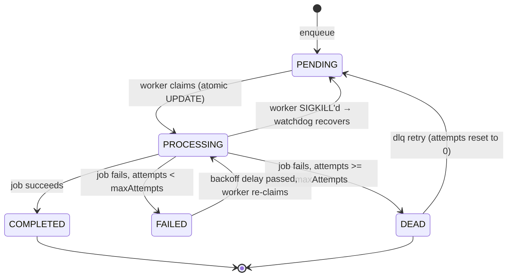
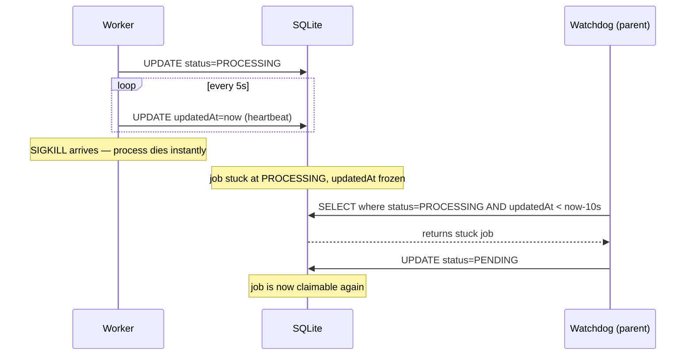

# QueueCTL — Design Decisions

---

## Architecture Overview

### How workers run across terminals

Multiple terminals can each run `worker start`. All spawned workers share the same SQLite database and the same `~/.queuectl/workers.json` registry.

```
Terminal 1                         Terminal 2
──────────────────                 ──────────────────
queuectl worker start              queuectl worker start
--count 2                          --count 1
    │                                  │
    ├── worker-1 (PID 101)             ├── worker-1 (PID 201)
    └── worker-2 (PID 102)            (different parent, same DB)
         │          │                      │
         └──────────┴──────────────────────┘
                         │
                  SQLite (queue.db)
                  ~/.queuectl/workers.json
```

`worker stop` reads `workers.json`, gets all PIDs, sends `SIGTERM` to each — regardless of which terminal started them.

---

### Job lifecycle



---

### Heartbeat + Watchdog (SIGKILL recovery)



---

## Five Questions

### Q1 — Which exact lines prevent two workers from claiming the same job, and why is that operation atomic across separate OS processes?

**The lines** — `src/cli/commands/worker.ts`, inside `pollJobs()`:

```typescript
const job = await jobRepo.query(`
    UPDATE jobs
    SET status = 'PROCESSING', attempts = attempts + 1
    WHERE id = (
        SELECT id FROM jobs
        WHERE status IN ('PENDING', 'FAILED')
        AND (runAfter IS NULL OR runAfter <= datetime('now'))
        ORDER BY createdAt ASC
        LIMIT 1
    )
    RETURNING *;
`);
```

**Why it's atomic:** This is a single SQL statement. SQLite serialises all write transactions — only one can run at a time, even from separate OS processes. So if Worker A and Worker B both fire this query simultaneously:

- Worker A's `UPDATE` acquires the write lock first, claims the row, commits.
- Worker B's `UPDATE` runs next. The row is now `PROCESSING`, so the subquery finds nothing, zero rows are updated.

No row is ever claimed twice. The old approach (separate `SELECT` then `UPDATE`) had a race window between the two statements where both workers could read the same `PENDING` row before either wrote `PROCESSING`.

---

### Q2 — A worker is SIGKILL'd halfway through a job. Walk through what happens and what is the worst-case recovery delay.

**Step by step:**

1. Worker claims job → DB row: `status=PROCESSING`, `attempts=2`
2. Job starts running (`exec(command)`)
3. Worker sends a heartbeat every **5s** → bumps `updatedAt` in DB
4. `SIGKILL` arrives → OS kills the process instantly. No JavaScript runs, no `finally` block, nothing.
5. DB row stays at `status=PROCESSING`. `updatedAt` is frozen at the last heartbeat.

**Recovery:**

The parent process runs a watchdog every **10s** that looks for jobs where:
- `status = PROCESSING` AND
- `updatedAt < now - 10s` (two missed heartbeats)

Those jobs are reset to `PENDING`. The next available worker picks them up atomically.

**Worst-case delay:**

```
Last heartbeat    SIGKILL       Watchdog fires     Worker picks it up
     T=0           T=1ms           T=10s               T=15s
      │              │               │                    │
      └──────────────┴───────────────┴────────────────────┘
                                  ~15 seconds
```

> `SIGTERM` (from `worker stop`) is graceful — the current job finishes before the process exits. This scenario only applies to `SIGKILL` or an OS crash.

---

### Q3 — Does `dlq retry` reset `attempts`? Why?

**Yes — `attempts` is reset to `0`.**

Without resetting, here's what happens: a DEAD job has `attempts = 3 = maxAttempts`. The worker claims it and does `attempts + 1 = 4`. The job runs and fails. Check: `4 >= 3` → true → **immediately DEAD again**. The job got exactly one shot with no backoff, no retry cycle.

With reset: `attempts = 0`, the full cycle applies — backoff delays, up to `maxAttempts` retries — exactly like a fresh job.

The counter-argument is "the operator might loop forever in the DLQ". That's an operator decision, not a system one. The system should honour the intent of "give this job another chance", not silently give a one-shot coinflip.

---

### Q4 — How does `worker stop` signal workers across terminals? What was considered and rejected?

**The challenge:** `worker stop` runs in Terminal B. Workers run in Terminal A. Separate OS processes, no shared memory.

#### ✅ Chosen — `~/.queuectl/workers.json` (file-based registry)

Each worker writes `{ pid, workerId, startedAt }` to the registry on startup and removes itself on exit. `worker stop` reads the file, checks each PID is alive (`process.kill(pid, 0)`), sends `SIGTERM`, and waits for them to exit.

**Why:** Zero extra dependencies, works across any terminal, stale entries are caught by the liveness check. Same pattern used by nginx, PostgreSQL, Redis.

**Downside accepted:** If a worker crashes without deregistering AND the OS reassigns that exact PID to an unrelated process before `worker stop` runs, we'd signal the wrong process. Extremely unlikely in practice.

---

#### ❌ Rejected — DB shutdown flag

Add a `shutdown_requested` column. Workers poll it; `worker stop` flips it.

**Why rejected:** The DB is a job store, not a control plane. Polling adds unnecessary DB traffic for a rare operation. Also fails if the DB is locked.

---

#### ❌ Rejected — Unix domain socket

Each worker listens on a socket. `worker stop` connects and sends a shutdown message.

**Why rejected:** Overkill for a simple "please stop" signal. Requires each worker to run a socket server in parallel with the job loop. Same stale-file problem as registry, but with far more code.

---

### Q5 — If priorities were added tomorrow, what survives and what breaks?

#### Survives unchanged

| Part | Why |
|---|---|
| `processJob()` | Runs whatever job it receives — scheduling is not its concern |
| Graceful shutdown | Completely unrelated to priority |
| `stop-workers.ts` | No change needed |
| `enqueue-job.ts` | Just add `priority` to the input JSON and entity |
| `Job` entity | Add `@Column({ default: 0 }) priority: number` — TypeORM syncs it |

#### Breaks

| Part | Problem | Fix |
|---|---|---|
| `pollJobs()` subquery | `ORDER BY createdAt ASC` ignores priority — high-priority jobs wait behind old low-priority ones | Change to `ORDER BY priority DESC, createdAt ASC` — one line |
| Fairness | All workers race for the same top-priority job, low-priority jobs starve | Need priority-bucketed queues or weighted selection — bigger change |

The subquery `ORDER BY` is the only line of code that breaks. The deeper problem is starvation under sustained high-priority load, which needs a scheduling algorithm change.
